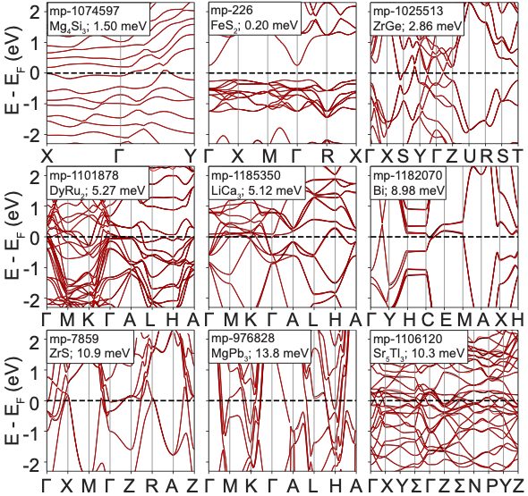

The discovery of functional materials for energy harvesting and electronic applications require accurate predictions of their optical and transport properties. While several existing datasets contain the optical and transport properties calculated from first-principles calculations, the amount of material entries is often limited and those properties are often reported in scalar form. Comprehensive datasets for the tensorial properties, particularly optical properties, still remain inadequate, which prevents from capturing the anisotropy effect in materials. Therefore, in this work we present the largest-to-date dataset of tensorial optical properties (optical conductivity, shift current) and the dataset of tensorial transport properties (electrical conductivity, thermal conductivity, Seebeck coefficient, thermoelectric figure of merit zT) for 7301 materials, calculated from the Wannier function method. The quality of the Wannier functions were validated by the maximal spread of the Wannier functions and by the comparison with the band structures from first-principles calculations. These results contribute to the systematic study the functional properties for diverse materials and can benefit future data-driven discovery of candidate materials for optoelectronic and thermoelectric applications.

